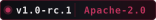
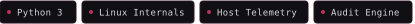
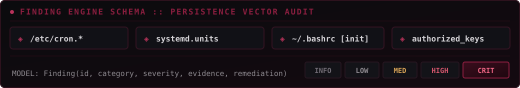

<!-- MINIMAL ANIMATED TELEMETRY STREAM COMPONENT -->

 

  <b>Cybersecurity researcher &amp; systems engineer</b> exploring <b>offensive primitives</b>, <b>Linux host telemetry</b>, and <b>explainable detection pipelines</b>. 
  Dissecting attack surfaces down to daemon and initialization vectors to engineer inspectable, high-resilience security systems.

 

### ─[ FEATURED WORK ]───────────────────────────────────────────────────

<table>
  <tr>
    <td width="100%" valign="top">
      <h4><a href="https://github.com/0xraiven/phishGuard">01 / phishGuard</a> &nbsp;</h4>
      
Privacy-first ML phishing detection platform &amp; Chrome extension. Defense-in-depth pipeline decoupling URL canonicalization, heuristics, and CatBoost inference with SHAP explainability.

      

      
<a href="https://github.com/0xraiven/phishGuard"><b>VIEW CODEBASE</b> &nbsp;──▶</a>

      <!-- Interactive Pipeline Inspection Drawer -->
      

        
<b>◈ PIPELINE ARCHITECTURE</b> &nbsp;[INSPECT]

         
        
      

    </td>
  </tr>
  <tr>
    <td width="100%" valign="top">
      <h4><a href="https://github.com/0xraiven/persistHunt">02 / persistHunt</a> &nbsp;</h4>
      
Linux persistence detection framework. Standardizes host anomaly telemetry across cron schedules, systemd service units, and shell environment initialization vectors.

      

      
<a href="https://github.com/0xraiven/persistHunt"><b>VIEW CODEBASE</b> &nbsp;──▶</a>

      <!-- Interactive Finding Model Inspection Drawer -->
      

        
<b>◈ DETECTION SCHEMA</b> &nbsp;[INSPECT]

         
        
      

    </td>
  </tr>
</table>

### ─[ TELEMETRY ]───────────────────────────────────────────────────────

<table>
  <tr>
    <td width="58%" valign="middle" align="center">
      
    </td>
    <td width="42%" valign="middle" align="center">
      
    </td>
  </tr>
</table>

  
  &nbsp;
  

<!-- INVISIBLE REALTIME INGRESS TELEMETRY TRIGGER -->

<!--
  [CONFIGURABLE HOOKS FOR FUTURE PROFILES]
  
  
-->

